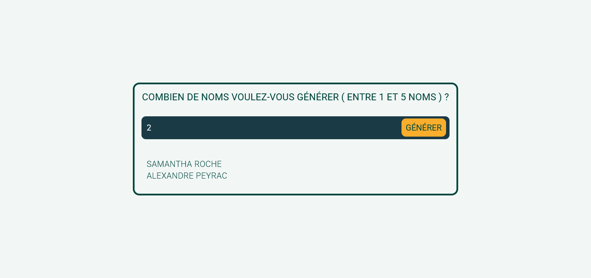

## GENERATEUR DE NOMS ALEATOIRE

## Le challenge

Création d'un générateur de nom aléatoire qui va permettre à l'utilisateur de créer jusqu'à 5 noms au maximun.

## Démonstration

Lien vers le projet : https://aperbet56.github.io/random_names/

## Projet développé avec

- Utilisation des balises sémantiques HTML5
- Importation de la police "Roboto"
- CSS3
- Flexbox
- Page web responsive
- Desktop first
- Importation d'un normaliseur : le fichier normalize.css
- JavaScript
- Code JavaScript commenté
